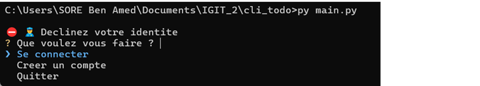
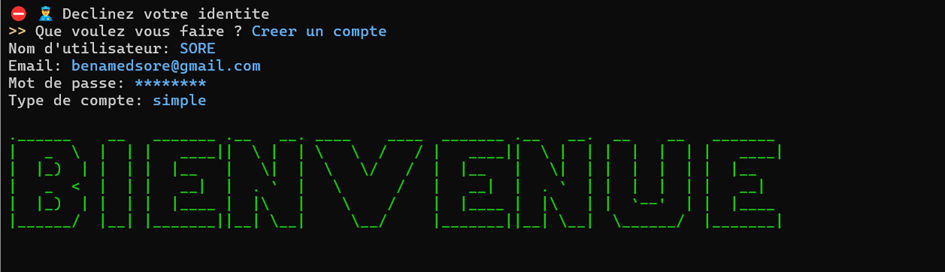
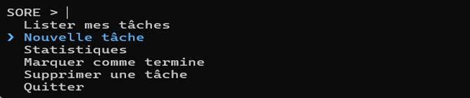
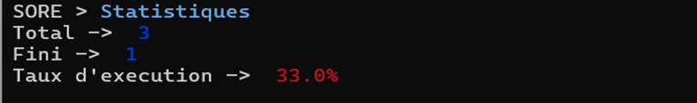
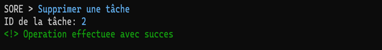
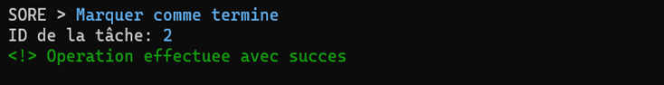
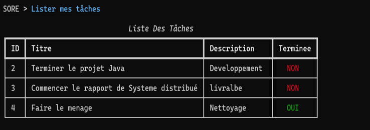

# cli_todo

Cli_todo est une application de gestion de taches.

## Objectif du projet

L'objectif du projet est de créer une solution logicielle simple mais puissante qui permettra aux utilisateurs de planifier, organiser et suivre leurs tâches de manière efficace. En mettant l'accent sur l'apprentissage des tests logiciels et de l'intégration continue, nous cherchons également à acquérir des compétences pratiques et à comprendre les défis du développement d'applications dans un environnement collaboratif.

## Phase d'installation de l'application
Pour que le lancement de l'appli soit effectif, il est nécessaire d'installer certaines dépendances se trouvant dans le fichier "requerements.txt". Pour se faire, il suffit de taper la commande suivante en ligne de commande: 
```python
pip install requirements.txt
```
Ensuite il faut lancer le l'application en tapant:
```python
python main.py
```

## Mode d'utilisation de l'application
Une fois après avoir lancé le fichier "main.py", l'utilisateur devra se connecter pour continuer. Dans le cas ou l'utilisateur n'a pas de compte, il devra en créer un.



Une-fois après la connexion, l'utilisateur pourra maintenant procéder a la gestion de ses taches. 




## Les fonctionnalités_Clés dans l'application
#### 1-Creation des taches
Dans cette fenetre, l'utilisateur peut creer une nouvelle tache en inserant juste des informations sur la tache.

####  2-Afficher les statistiques de l'ensemble des taches
Dans cette option, l'utilisateur peut voir la moyenne des taches finie par rapport a l'ensemble des taches.

####  3-Supprimer des taches
    En entrant l'ID de la tachem nous pouvos la supprimer.

####  4-Marquer une tache terminée

####  5-Lister l'ensemble des taches 
Dans cette option, l'utilisateur a une vue de l'ensemble de ses taches qu'il a crée.

